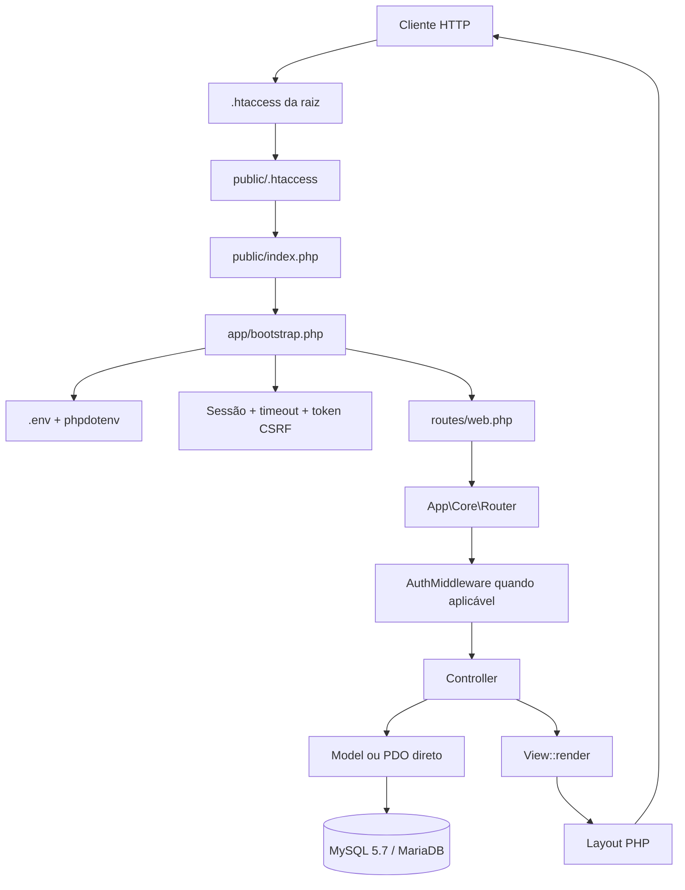
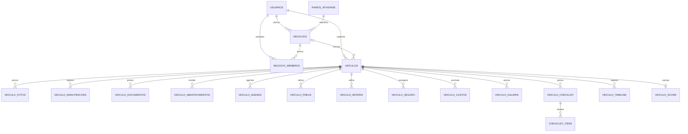
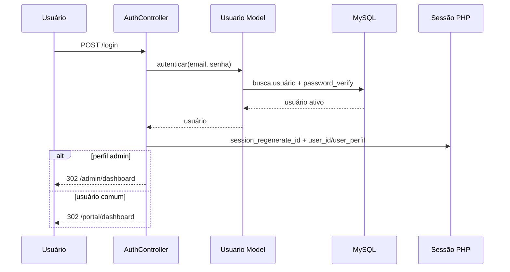
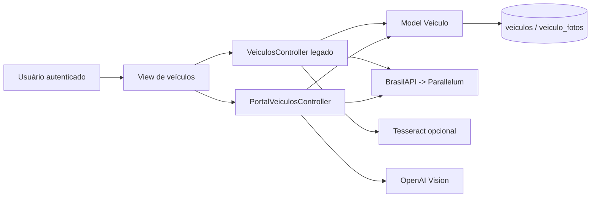

# AppAuto — Mapa Técnico do Sistema

> **Status:** mapeamento estático concluído em 13 de agosto de 2026.
> **Fonte de verdade:** branch `main`, commit `77bbe18` (`fix: corrige erro 500 no /login e loop de redirect`).
> **Escopo:** o documento descreve somente o que foi confirmado no código e no SQL versionados. Não confirma o estado do banco nem dos arquivos instalados no servidor Hostgator.

## 1. Sumário executivo

O AppAuto é um SaaS automotivo em **PHP MVC puro**, com roteador próprio, renderização de views PHP, sessão nativa e MySQL/MariaDB. O fluxo de produto implementado concentra-se em autenticação por e-mail, cadastro PF/PJ, portal de veículos, administração e uma camada inicial de gestão de negócios. O módulo mais desenvolvido é o Portal de Veículos, cuja migração complementar cria dados de manutenção, documentos, abastecimentos, pneus, bateria, seguro, custos, agenda, checklist, galeria, timeline, score e marketplace.

A base contém também uma parcela relevante de código herdado do ERP anterior. Há rotas, controllers, views e documentos que são apenas placeholders, ou que apontam para classes, métodos e templates ausentes. Por isso, a aplicação deve ser considerada **em consolidação**, e não uma base pronta para produção sem a correção dos itens P0 e P1 registrados neste mapa.

| Dimensão | Estado confirmado no repositório |
|---|---|
| Branch principal | `main`, sem outras branches remotas além de `origin/main` |
| Commit analisado | `77bbe18` |
| Dependência PHP declarada | `vlucas/phpdotenv ^5.5` |
| Arquitetura | PHP MVC próprio, PDO, Composer/PSR-4 |
| Tabelas no schema + migration | 26 tabelas |
| Rotas registradas | 84 rotas HTTP, incluindo 8 públicas |
| Controllers físicos | 16 |
| Models físicos | 4, dos quais 1 é legado |
| Views físicas | 45 templates PHP, incluindo 9 layouts |
| Document root esperado | `public/` |

## 2. Arquitetura real

A entrada web é `public/index.php`, que define `BASE_PATH` e carrega `app/bootstrap.php`. O bootstrap carrega o autoload Composer, lê `.env` com `phpdotenv`, valida configuração mínima de banco, configura tratamento de erros, timezone e cookie de sessão; depois carrega `routes/web.php` e despacha a requisição com `Router::dispatch()`.

### 2.1 Estrutura de diretórios

| Diretório/arquivo | Finalidade confirmada | Observações |
|---|---|---|
| `app/Controllers/` | Controladores MVC e algumas regras de negócio | `PortalController` concentra grande parte do SQL e da lógica de domínio. |
| `app/Core/` | Router, banco PDO, base de controller/model, view, logger, helper de senha | Não há container, serviço de domínio ou ORM. |
| `app/Middlewares/` | Autenticação, timeout e CSRF | Só `AuthMiddleware` está registrado no Router. |
| `app/Models/` | Persistência de usuários, negócios e veículos | `User.php` aponta para tabela legada inexistente no schema. |
| `app/Views/` | Templates, layouts públicos, portal, admin e legados | Parte das views inclui seu layout diretamente. |
| `config/` | Configuração de conexão PDO por variáveis de ambiente | Apenas `database.php`. |
| `database/` | Schema base, migration 002 e seed | Schema e migration são a referência versionada; estado de produção não foi consultado. |
| `routes/` | Definição das rotas | Um único arquivo: `web.php`. |
| `public/` | Document root, assets, uploads e entrypoint | Contém scripts públicos de diagnóstico que não devem permanecer expostos. |
| `storage/logs/` | Destino dos logs gerados pelo `Logger` | Logs versionados são ignorados, exceto `.gitkeep`. |
| `vendor/` | Dependências Composer incluídas para deploy em hospedagem sem SSH | Está deliberadamente versionado. |
| `md/` | Documentação histórica de debugging e autenticação | Majoritariamente herdada do INLAUDO/ERP. |

## 3. Dependências e execução

| Item | Versão/forma | Finalidade | Uso confirmado |
|---|---|---|---|
| PHP | `>= 8.0` no Composer; produção descrita como PHP 8.3 | Runtime | Sintaxe tipada, `PASSWORD_ARGON2ID`, PDO e sessões. |
| `vlucas/phpdotenv` | `^5.5` | Carregar `.env` | `app/bootstrap.php`. |
| PDO MySQL | Extensão PHP | Acesso a banco | `App\Core\Database`. |
| cURL | Extensão PHP | APIs de placa e OpenAI | Controllers do portal. |
| `mail()` | Nativo PHP | Envio do token de e-mail | `AuthController`. |
| Tesseract | Binário opcional do host | OCR local do CRLV no fluxo legado | `Models/Veiculo.php`. |
| Bootstrap, Font Awesome e Chart.js | CDN | UI do portal e gráficos | Layouts e views. |

O `composer.json` declara autoload PSR-4 `App\\ => app/`. O Composer também está configurado com autoloader otimizado e `prefer-stable`, embora `minimum-stability` seja `dev`.

## 4. Rotas e matriz de endpoints

As oito primeiras rotas são públicas. Todas as demais estão dentro do grupo `Auth`, que apenas exige a presença de `$_SESSION['user_id']`. Não existe middleware de autorização por perfil, negócio ou tenant registrado no Router.

### 4.1 Rotas públicas

| Método | URL | Action | Resposta esperada | Situação |
|---|---|---|---|---|
| GET | `/login` | `AuthController@showLoginForm` | view `auth/login` | Implementada |
| POST | `/login` | `AuthController@login` | redirecionamento admin/portal | Implementada |
| GET | `/cadastro` | `AuthController@showCadastroForm` | view `auth/cadastro` | Implementada |
| POST | `/cadastro` | `AuthController@cadastrar` | cria usuário/negócio e redireciona | Implementada, sem CSRF aplicado no Router |
| GET | `/validar-token` | `AuthController@showValidarToken` | view `auth/validar_token` | Implementada |
| POST | `/validar-token` | `AuthController@validarToken` | ativa usuário e redireciona | Implementada, sem CSRF aplicado no Router |
| GET | `/reenviar-token` | `AuthController@reenviarToken` | emite novo token e redireciona | Implementada; efeito de escrita em GET |
| GET/POST | `/recuperar-senha` | `AuthController@showRecuperarSenha` / `recuperarSenha` | deveria recuperar senha | **Quebrada:** os dois métodos não existem |

### 4.2 Rotas protegidas: navegação e veículos

| Método | URL | Action | Dados/tabelas principais | Situação |
|---|---|---|---|---|
| GET | `/` | `HomeController@index` | sessão | Redireciona por perfil |
| GET | `/dashboard` | `DashboardController@index` | sessão | Alias/redirecionamento legado |
| GET/POST | `/logout` | `AuthController@logout` | sessão | Implementada; GET é mantido por compatibilidade |
| GET | `/portal/dashboard` | `PortalController@dashboard` | `veiculos`, tabelas portal | Implementada com tratamento parcial de migration pendente |
| GET | `/portal/veiculos` | `PortalVeiculosController@index` | `veiculos`, `veiculo_fotos` | Controller existe, mas o contrato do model diverge em ações de escrita |
| GET/POST | `/portal/veiculos/adicionar` | `PortalVeiculosController@showAdicionar` / `adicionar` | `veiculos`, `veiculo_fotos` | **Quebrada em POST:** chama métodos inexistentes/assinaturas incompatíveis no model |
| GET | `/portal/veiculos/consultar-placa` | `PortalVeiculosController@showConsultarPlaca` | sem banco | Implementada |
| GET | `/portal/veiculos/api/consultar-placa` | `PortalVeiculosController@apiConsultarPlaca` | BrasilAPI/Parallelum | Implementação própria, sem registro de histórico |
| POST | `/portal/veiculos/api/ocr` | `PortalVeiculosController@apiOCR` | OpenAI Vision | Sem CSRF; usa `getenv`, divergente do bootstrap |
| POST | `/portal/selecionar-veiculo` | `PortalVeiculosController@selecionarVeiculo` | sessão, veículos | **Quebrada:** assinatura de `buscarPorId` incompatível + campo CSRF divergente |
| GET/POST | `/portal/veiculos/{id}/editar` | `PortalVeiculosController@showEditar` / `editar` | veículos | **Quebrada:** `buscarPorId`, `validar` e `atualizar` não batem com model |
| POST | `/portal/veiculos/{id}/excluir` | `PortalVeiculosController@excluir` | veículos | **Quebrada:** método `excluir` ausente no model |
| GET | `/veiculos` | `VeiculosController@index` | `veiculos` | Fluxo legado, implementado |
| GET/POST | `/veiculos/adicionar` | `VeiculosController@showAdicionar` / `adicionar` | `veiculos`, `veiculo_fotos` | Funcional estático; sem CSRF verificado |
| GET | `/veiculos/consultar-placa` | `VeiculosController@showConsultarPlaca` | APIs e `consultas_placa` | Implementada |
| GET | `/veiculos/api/consultar-placa` | `VeiculosController@apiConsultarPlaca` | BrasilAPI/Parallelum, `consultas_placa` | Implementada, sujeita à disponibilidade externa |
| POST | `/veiculos/api/ocr` | `VeiculosController@apiOCR` | Tesseract local | Implementada condicionalmente ao binário |
| GET | `/veiculos/{id}` | `VeiculosController@show` | veículos/fotos | **Quebrada:** solicita view `veiculos/show` inexistente |
| GET/POST | `/veiculos/{id}/editar` | `VeiculosController@showEditar` / `editar` | veículos | **Quebrada:** métodos ausentes |
| POST | `/veiculos/{id}/excluir` | `VeiculosController@excluir` | veículos | **Quebrada:** método ausente |

### 4.3 Rotas protegidas: Portal de Veículos

| Módulo | GET | POST | Controller | Tabelas | Estado |
|---|---|---|---|---|---|
| Manutenções | `/portal/manutencoes`, `/adicionar` | `/salvar` | `PortalController` | `veiculo_manutencoes`, custos, timeline | Consulta e gravação existem; formulário não tem verificação CSRF aplicada. |
| Documentos | `/portal/documentos`, `/adicionar` | `/salvar` | `PortalController` | `veiculo_documentos` | Upload sem validação de MIME, extensão ou tamanho. |
| Abastecimentos | `/portal/abastecimentos`, `/adicionar` | `/salvar` | `PortalController` | `veiculo_abastecimentos`, custos | Implementado; gera custo automático. |
| Pneus | `/portal/pneus` | `/salvar` | `PortalController` | `veiculo_pneus` | Implementado; marca item prévio inativo. |
| Bateria | `/portal/bateria` | `/salvar` | `PortalController` | `veiculo_bateria` | Implementado; marca item prévio inativo. |
| Seguro | `/portal/seguro` | `/salvar` | `PortalController` | `veiculo_seguro` | Implementado. |
| Custos | `/portal/custos` | — | `PortalController` | `veiculo_custos` | Consulta/análise anual. |
| Agenda | `/portal/agenda` | `/salvar` | `PortalController` | `veiculo_agenda` | Implementado; não há job de notificação. |
| Checklist | `/portal/checklist`, `/novo` | `/salvar` | `PortalController` | `veiculo_checklist`, `checklist_itens` | Implementado. |
| Galeria | `/portal/galeria` | `/salvar` | `PortalController` | `veiculo_galeria` | Upload sem validação. |
| Timeline | `/portal/timeline` | — | `PortalController` | `veiculo_timeline` | Leitura; eventos automáticos apenas em manutenção. |
| IPVA | `/portal/ipva` | — | `PortalController` | `veiculo_ipva` | **Quebrada:** view `portal/ipva/index` inexistente. |
| Relatórios | `/portal/relatorios` | — | `PortalController` | indireto | Catálogo de links, não exporta relatório. |
| IA | `/portal/ia` | `/portal/ia/chat` | `PortalController` | OpenAI | Endpoint de chat sem CSRF e sem timeout explícito. |
| Marketplace | `/portal/marketplace` | — | `PortalController` | `marketplace_ofertas` | Consulta ofertas ativas; sem cadastro/gestão. |

### 4.4 Rotas protegidas: PJ, perfil e administração

| Área | Rota(s) | Action | Estado confirmado |
|---|---|---|---|
| Meu Negócio | `/negocio/dashboard`, `/clientes`, `/servicos` | `NegocioController@*` | **Quebrada:** `NegocioController` não existe. |
| Perfil | `/perfil` GET/POST | `PerfilController@index/atualizar` | **Quebrada:** `PerfilController` não existe. |
| Configurações | `/configuracoes` | `ConfiguracoesController@index` | Placeholder. |
| Admin dashboard | `/admin/dashboard` | `AdminController@dashboard` | Implementada, com guarda privada de admin. |
| Admin pessoas | `/admin/clientes/pessoas` | `AdminController@clientesPessoas` | Implementada. |
| Admin negócios | `/admin/clientes/negocios` | `AdminController@clientesNegocios` | Implementada. |
| Impersonação pessoa | `/admin/acessar-como/{id}` | `AdminController@acessarComo` | Implementada por sessão, via GET. |
| Impersonação negócio | `/admin/acessar-negocio/{id}` | `AdminController@acessarNegocio` | Redireciona para controller inexistente. |
| Sair da impersonação | `/admin/sair-impersonacao` | `AdminController@sairImpersonacao` | Implementada. |
| Admin logs/config/detalhes | `/admin/logs`, `/admin/configuracoes`, `/admin/usuario/{id}`, `/admin/negocio/{id}` | `AdminController@*` | **Quebradas:** quatro métodos ausentes. |
| Legado | `/clientes`, financeiro, faturamento, integração | controllers legado | Renderizam placeholder, sem regra de domínio. |

## 5. Controllers e responsabilidades

| Controller | Responsabilidade real | Dependências | Risco/observação |
|---|---|---|---|
| `AuthController` | Cadastro, login, token, logout e e-mail nativo | `Usuario`, `Negocio`, `View`, `Logger` | Recuperação de senha está roteada, mas ausente. Token é enviado em log de debug fora de produção. |
| `AdminController` | Dashboard, listas e impersonação | `Usuario`, `Negocio`, PDO direto | Métodos roteados ausentes; impersonação não grava `admin_sessoes`. |
| `PortalController` | Dashboard e 15 módulos de veículo | PDO direto, `View`, `Logger` | Arquivo grande, SQL e upload misturados, sem camada service/CSRF. |
| `PortalVeiculosController` | CRUD portal, placa, OpenAI OCR e seleção | `Veiculo`, PDO, cURL | Contrato incompatível com `Veiculo`; duplicação do módulo legado. |
| `VeiculosController` | Fluxo antigo de CRUD/placa/OCR | `Veiculo` | CRUD incompleto e view de detalhe ausente. |
| `HomeController` | Redirecionamento inicial por perfil | sessão | Usa `user_perfil` com fallback legado `user_role`. |
| `DashboardController` | Redirecionamento de compatibilidade | sessão | Não renderiza o dashboard legado. |
| `Clientes`, `Configurações`, `Contas*`, `Contratos`, `Faturamento`, `Financeiro`, `Integração`, `Integrações` | Módulos herdados | `View` | Majoritariamente placeholders/sem rota. |

## 6. Models e fluxo Controller → Model → Tabela

| Model | Tabela(s) | Chamado por | Estado |
|---|---|---|---|
| `Usuario` | `usuarios` | Auth, Admin | Model principal de usuários; usa Argon2id e prepared statements. |
| `Negocio` | `negocios`, `ramos_atividade`, `usuarios` | Auth, Admin | Propriedade por `negocios.usuario_id`; não implementa membros. |
| `Veiculo` | `veiculos`, `veiculo_fotos`, `consultas_placa` | PortalVeiculos, Veiculos | Implementa fluxo legado. Não oferece `validar`, `atualizar` ou `excluir`; `buscarPorId` não recebe usuário. |
| `User` | `users` | Nenhum controller atual | Legado/incompatível: schema não tem `users`. |

A composição correta já observada no fluxo legado é `VeiculosController → Veiculo → veiculos/veiculo_fotos/consultas_placa`. O fluxo `PortalVeiculosController → Veiculo` foi escrito contra uma API de model diferente da que está no repositório e, portanto, não deve ser considerado funcional.

## 7. Banco de dados e entidades

### 7.1 Entidades do schema base

| Tabela | Finalidade | PK | Relacionamentos/FKs | Uso real |
|---|---|---|---|---|
| `ramos_atividade` | Catálogo de ramos automotivos | `id` | Referenciada por `negocios` | Cadastro e listagem de negócio. |
| `usuarios` | Conta, credencial, perfil, token | `id` | Pai de negócios, veículos, membros e tokens | Fluxo principal de auth/admin. |
| `negocios` | Empresa/PJ, plano e endereço | `id` | FK para usuário e ramo | Cadastro PJ e Admin. |
| `negocio_membros` | Vínculo usuário-negócio e permissão | `id` | FKs para negócio/usuário | Estrutura não consumida por controller/model atual. |
| `veiculos` | Veículos de usuário ou negócio | `id` | FK para usuário; negócio opcional | Fluxos de veículos. |
| `veiculo_fotos` | Fotos associadas ao veículo | `id` | FK para veículo | Fluxos legado e portal. |
| `consultas_placa` | Histórico de consulta | `id` | Índice em usuário, sem FK declarada | Somente `VeiculosController`. |
| `audit_logs` | Auditoria estruturada | `id` | Índices em usuário/negócio | Estrutura não consumida. |
| `email_tokens` | Tokens normalizados | `id` | FK para usuário | Estrutura não consumida; token fica em `usuarios`. |
| `admin_sessoes` | Registro de impersonação | `id` | Apenas índice no admin | Estrutura não consumida; estado fica em sessão PHP. |

### 7.2 Entidades da migration 002

| Tabela | Finalidade | Escopo/índices | Consumidor atual |
|---|---|---|---|
| `veiculo_documentos` | Arquivos e metadados de documentos | `veiculo_id`, `usuario_id` | Portal documentos |
| `veiculo_manutencoes` | Serviços e oficina | veículo, usuário, data | Portal manutenções |
| `manutencao_fotos` | Fotos de manutenção | manutenção | Não consumida |
| `veiculo_agenda` | Serviços futuros | veículo, usuário, data | Portal agenda/dashboard |
| `veiculo_abastecimentos` | Consumo e custos | veículo, usuário, data | Portal abastecimentos |
| `veiculo_pneus` | Histórico de pneus | veículo, usuário | Portal pneus |
| `veiculo_bateria` | Registro de bateria ativa | veículo, usuário | Portal bateria |
| `veiculo_seguro` | Apólices e vencimentos | veículo, usuário, vencimento | Portal seguro |
| `veiculo_ipva` | IPVA, licenciamento, multas e recall | veículo, usuário | Controller existe; view ausente |
| `veiculo_custos` | Consolidação de custos | veículo, usuário, data, categoria | Custos e geração automática parcial |
| `veiculo_galeria` | Fotos gerais | veículo, usuário | Portal galeria |
| `veiculo_checklist` | Cabeçalho de checklist | veículo, usuário | Portal checklist |
| `checklist_itens` | Itens do checklist | checklist | Portal checklist |
| `veiculo_timeline` | Eventos cronológicos | veículo, usuário, data | Portal timeline |
| `veiculo_score` | Pontuação de saúde | único por veículo, usuário | Dashboard lê; não há cálculo confirmado |
| `marketplace_ofertas` | Ofertas estáticas de parceiros | tipo, cidade | Portal marketplace |

A migration 002 não declara foreign keys para suas tabelas. Ela usa `veiculo_id` e `usuario_id` como chaves de escopo em índices simples; a integridade referencial depende da aplicação.

## 8. Autenticação, sessão e autorização

### 8.1 Fluxo de autenticação

O login recebe e-mail e senha, exige `usuarios.status = ativo`, verifica a senha com `password_verify`, chama `session_regenerate_id(true)` e grava as chaves `user_id`, `user_name`, `user_email`, `user_perfil`, `tipo_conta`, `last_activity` e `csrf_token`. O timeout global é de 3.600 segundos. A sessão usa cookies `HttpOnly`, `SameSite=Lax`, e `Secure` apenas quando `APP_ENV=prod`.

O cadastro gera token alfanumérico de seis caracteres por 30 minutos, armazena-o nos campos `usuarios.token_validacao` e `token_expira_em`, e utiliza `mail()` para envio. A validação ativa o usuário e marca o e-mail como verificado.

### 8.2 Autorização e chaves de sessão

A guarda de rota `AuthMiddleware` apenas verifica `user_id`. O painel admin implementa uma guarda privada própria que valida `user_perfil === 'admin'`. A base `Controller::requireAdmin()`, por outro lado, usa a chave legada `user_role`. Os layouts também leem `is_admin`, `is_negocio`, `user_type` e `user_role`, que não são gravadas no fluxo de login.

| Chave gravada no fluxo | Chave também lida | Consequência |
|---|---|---|
| `user_perfil` | `user_role`, `user_type`, `is_admin` | Menus e guardas base podem não refletir o perfil real. |
| `tipo_conta` | `is_negocio` | Link de negócio no portal pode nunca ser exibido. |
| `admin_original_*` | `impersonated_negocio` | Impersonação é apenas estado de sessão, sem trilha persistente. |
| `csrf_token` | `_csrf` e `csrf_token` | Proteção CSRF é inconsistente. |

### 8.3 Impersonação

`AdminController@acessarComo` preserva o contexto original em `admin_original_*`, substitui as chaves de sessão pelo usuário escolhido e redireciona ao portal. `acessarNegocio` faz o mesmo, mas utiliza `user_perfil = admin_negocio` e redireciona para uma rota cujo controller não existe. A tabela `admin_sessoes` está no schema, mas não é usada pelo código atual.

## 9. Multi-tenant e isolamento de dados

O modelo físico prevê propriedade direta por usuário em `veiculos.usuario_id` e uma associação opcional a `veiculos.negocio_id`. O portal também replica `usuario_id` e `veiculo_id` em quase todas as tabelas derivadas. O `PortalController` normalmente filtra as consultas por ambos, o que é uma defesa importante contra acesso cruzado dentro dos módulos já implementados.

Entretanto, o isolamento por negócio não está implementado como tenant completo. `negocio_membros` não é consumida, não existe resolução do negócio corrente após o login e não há escopo obrigatório de `negocio_id` no router ou em uma camada de autorização. Assim, o sistema real é hoje predominantemente **multiusuário por proprietário (`usuario_id`)**, não multi-tenant completo por negócio/membro.

| Controle | Evidência | Avaliação |
|---|---|---|
| Veículos no fluxo legado | `VeiculosController@show` compara `usuario_id` da sessão | Presente para leitura de detalhe. |
| Dados do portal | Queries usam `veiculo_id` + `usuario_id` | Presente na maior parte do `PortalController`. |
| Portal CRUD novo | Pretende passar `userId` ao model | Não funciona porque as assinaturas do model divergem. |
| Negócios/membros | Schema cria relacionamento | Não aplicado em autorização. |
| Admin | Guarda privada em `AdminController` | Presente nas ações administrativas implementadas. |

## 10. Módulo de veículos, APIs e OCR

O módulo aceita placa antiga (`AAA0000`) e Mercosul (`AAA0A00`), normaliza removendo caracteres especiais e persiste o formato. Há duas implementações paralelas: o fluxo legado em `VeiculosController` e o fluxo de portal em `PortalVeiculosController`.

| Integração | Onde é usada | Configuração | Tratamento observado |
|---|---|---|---|
| BrasilAPI vehicles | `Veiculo` e `PortalVeiculosController` | Sem chave | Timeout de oito segundos nas implementações cURL; endpoint pode não corresponder ao serviço esperado. |
| Parallelum/placa-fipe | `Veiculo` e `PortalVeiculosController` | Sem chave | Fallback; endpoints diferem entre os dois fluxos. |
| OpenAI Chat Completions | `PortalController@iaChat` | `$_ENV['OPENAI_API_KEY']` | Sem timeout explícito; resposta genérica em erro. |
| OpenAI Vision | `PortalVeiculosController@apiOCR` | `getenv('OPENAI_API_KEY')` | Pode não enxergar variável carregada por `createImmutable`; resposta JSON é extraída por regex. |
| Tesseract | `Veiculo@processarOCR` | Binário no host | Executa `which tesseract`; fallback para preenchimento manual. |
| E-mail nativo | `AuthController` | configuração do MTA do host | Retorno de `mail()` é ignorado; token logado em debug fora de produção. |

## 11. Uploads e arquivos

| Fluxo | Diretório público | Validação confirmada | Risco |
|---|---|---|---|
| Fotos do fluxo legado | `public/assets/uploads/veiculos/{id}/` | MIME `jpeg`, `png`, `webp`, `gif` | Sem limite de tamanho; extensão vem do nome do cliente. |
| Fotos do portal | `public/assets/uploads/veiculos/{id}/` | MIME `jpeg`, `png`, `webp` | Sem limite de tamanho; extensão do cliente; CRUD portal está quebrado. |
| Documentos do portal | `public/assets/uploads/documentos/` | **Nenhuma** | Alto risco de upload de arquivo não esperado para área pública. |
| Galeria do portal | `public/assets/uploads/galeria/` | **Nenhuma** | Alto risco de upload de arquivo não esperado para área pública. |
| OCR Vision | Arquivo temporário PHP | Só testa existência do upload | Sem limite/MIME prévio antes de converter para base64 e enviar a terceiro. |

## 12. Frontend e layouts

As views `auth/`, `admin/`, `veiculos/`, `negocio/`, `perfil/` e `portal/` são tratadas como self-contained por `View::render`, portanto incluem layouts diretamente. As views legadas recebem `erp_header.php` e `erp_footer.php` automaticamente. Esse modelo é funcional, mas coexistem layouts `app_*`, `erp_*`, `public_*`, `portal_*` e `header/footer`, evidenciando transição incompleta.

O portal usa Bootstrap, Font Awesome e Chart.js por CDN. Formulários de autenticação usam `View::csrfField()`, cujo campo é `csrf_token`. Muitos formulários do PortalController também enviam `csrf_token` manualmente, mas nenhuma rota aplica `CsrfMiddleware`. Já `PortalVeiculosController` espera `_csrf`, criando incompatibilidade com suas próprias views.

## 13. Segurança — auditoria estática inicial

> Esta auditoria é estática e de leitura. Não substitui teste autenticado, análise de configuração do Hostgator, teste de dependências ou revisão do banco em produção.

| Severidade | Achado | Evidência confirmada | Impacto | Prioridade recomendada |
|---|---|---|---|---|
| **CRÍTICO** | Scripts de diagnóstico executáveis no document root | `DEBUG_ERRO_500*.php`, `_envcheck.php`, `debug_login.php`, `diagnostico.php`, `test_env.php` | Expõem paths, versões, stack traces, configuração e estado do banco. | P0 |
| **CRÍTICO** | Log de erro público versionado | `public/error_log`, 2.881 bytes, 31 linhas, 27 padrões de erro/stack/path | Arquivo real pode ser servido diretamente porque o `.htaccess` permite arquivos físicos. | P0 |
| **ALTO** | CSRF não está conectado às rotas | Router registra somente `Auth`; forms POST e middleware não são aplicados globalmente | Alterações autenticadas podem ser acionadas por terceiro. | P0 |
| **ALTO** | Contrato CSRF incompatível no CRUD portal | Views enviam `csrf_token`; controller exige `_csrf` | Ações legítimas falham e a proteção fica fragmentada. | P0 |
| **ALTO** | Upload público sem validação no portal | `uploadArquivo()` aceita qualquer extensão/MIME para documentos e galeria | Upload de conteúdo perigoso, consumo de disco e arquivos publicamente acessíveis. | P0 |
| **ALTO** | Saídas sem escaping consistente | `email`, `error`, telefone, campos de negócio/veículo e atributos são renderizados em diversos templates sem escape uniforme | Possível XSS armazenado/refletido dependendo da origem do dado. | P1 |
| **ALTO** | Funções e rotas ausentes geram 500 | Controller/model/view mismatch mapeado | Indisponibilidade e risco de expor detalhes em modo dev. | P1 |
| **MÉDIO** | TLS desabilitado em consultas externas | `CURLOPT_SSL_VERIFYPEER => false` e contexto `verify_peer=false` | Possível ataque de interceptação nas consultas de placa. | P1 |
| **MÉDIO** | Recuperação de senha apenas roteada | Métodos e views ausentes; token table existe, mas não é usada | Funcionalidade de segurança incompleta. | P1 |
| **MÉDIO** | Impersonação por GET e sem persistência de auditoria | Rotas GET; tabela `admin_sessoes` não usada | Ação sensível não usa CSRF nem trilha no banco. | P1 |
| **MÉDIO** | Tokens de e-mail aparecem em debug log fora de produção | `Logger::debug("TOKEN [...] enviado")` | Segredo temporário em logs de desenvolvimento. | P2 |
| **MÉDIO** | Exposição de configuração em erros de bootstrap/banco | Bootstrap imprime falha de `.env`; DB imprime detalhes em dev | Risco se ambiente/servidor estiver configurado incorretamente. | P2 |
| **BAIXO** | Middleware `CsrfMiddleware` existe, mas não é registrado | `Router::$middlewares` contém somente Auth | Dívida de integração e falsa sensação de proteção. | P1 |
| **INFORMATIVO** | `.env` está ignorado pelo Git | `.gitignore` | Boa prática presente; não confirma ausência de segredo no servidor. | — |

### 13.1 SQL injection, IDOR e acesso administrativo

As consultas de dados de usuário, negócio e veículo usam predominantemente PDO prepared statements. O helper `PortalController::count()` interpola o nome da tabela, mas as chamadas atuais usam literais internos conhecidos; isso deve continuar restrito a uma whitelist. Em várias consultas do portal há filtro por `usuario_id` e `veiculo_id`, reduzindo o risco de IDOR nesses módulos.

As rotas admin são protegidas dentro dos métodos implementados por `AdminController::requireAdmin()`. Não existe, contudo, middleware administrativo central, e a classe base usa uma chave de sessão diferente (`user_role`) daquela produzida pelo login (`user_perfil`). A autorização por negócio/membro permanece ausente.

## 14. Inconsistências, código legado e dívida técnica

| Categoria | Evidência | Consequência |
|---|---|---|
| Model/Controller | `PortalVeiculosController` chama métodos inexistentes e assinaturas diferentes de `Veiculo` | Fatal errors em adicionar, editar, excluir e selecionar veículo. |
| Router/Controller | Auth recuperação, Negocio, Perfil e várias ações Admin estão em rota sem implementação | 500 em endpoints. |
| Controller/View | `portal/ipva/index` e `veiculos/show` inexistentes | 500 após renderização. |
| CSRF | Campo `csrf_token`, `_csrf` e middleware não registrado | Fluxo quebrado e proteção incompleta. |
| Sessão | Escrita usa `user_perfil`; leitura também usa `user_role`, `user_type`, `is_admin`, `is_negocio` | Menus/guards inconsistentes. |
| Multi-tenant | `negocio_membros`, `audit_logs`, `admin_sessoes`, `email_tokens` não são usados | Schema antecipa recursos que a aplicação não implementa. |
| Documentação | `DEPLOY.md`, `README_PATCH.md` e `md/*` citam INLAUDO/ERP e domínios antigos | Operação e manutenção podem seguir instruções incorretas. |
| Layout | Cinco famílias de layout coexistem | Alto custo de manutenção e comportamento visual divergente. |
| Banco | Migration 002 sem FKs e itens sem uso | Integridade e manutenção dependem de código não centralizado. |
| Produto | Relatórios, marketplace, Meu Negócio, perfil e módulos legados | Parcialmente implementados ou placeholders. |

## 15. Documentação existente

### Documentação confiável como referência parcial

`database/schema.sql`, `database/migrations/002_portal_veiculos.sql`, `routes/web.php`, `composer.json` e o código em `app/` são as fontes técnicas mais confiáveis, por corresponderem diretamente à implementação versionada. `DOCUMENTACAO.md` descreve o produto AppAuto, mas é parcial, contém instruções operacionais questionáveis e não substitui a leitura de código.

### Documentação histórica ou inconsistente

`DEPLOY.md`, `README_PATCH.md` e os documentos sob `md/` carregam referências ao INLAUDO ERP, domínios antigos, credenciais históricas, dashboard legado ou procedimentos de ambiente anteriores. Eles devem ser tratados como contexto histórico, não como instrução de deploy nem fonte de arquitetura atual.

## 16. Funcionalidades existentes e incompletas

| Existente no código | Incompleta, placeholder ou quebrada |
|---|---|
| Cadastro e login por e-mail; validação de e-mail por token; logout; sessão e timeout. | Recuperação de senha. |
| Cadastro de negócio no onboarding PJ; ramos de atividade. | Portal Meu Negócio e membros/permissões de negócio. |
| Admin: dashboard, listas e impersonação de pessoa. | Detalhes admin, logs, configurações e impersonação de negócio funcional. |
| Portal: manutenção, documentos, abastecimento, pneus, bateria, seguro, custos, agenda, checklist, galeria, timeline, IA e marketplace. | Proteção CSRF consistente, upload seguro, score calculado, notificações de agenda, gestão de IPVA e relatórios exportáveis. |
| Fluxo legado de veículo: listagem, cadastro, consulta de placa e OCR Tesseract. | Detalhe, edição/exclusão no legado; CRUD do portal novo. |
| Consulta de placa com fallbacks e OCR com dois caminhos. | Contratos de API consolidados, SSL verificado, timeout/tratamento uniforme e telemetria de falha. |

## 17. Decisões arquiteturais observadas

1. O deploy é orientado a hospedagem compartilhada Hostgator, razão para PDO simples, MySQL 5.7/utf8 e `vendor/` versionado.
2. O produto usa e-mail como identificador principal e mantém PF/PJ no mesmo registro `usuarios`.
3. O portal mantém um veículo ativo em sessão e relaciona módulos operacionais por `veiculo_id` e `usuario_id`.
4. A aplicação opera sem framework, service layer ou migrations runner; SQL e domínio coexistem nos controllers.
5. O portal novo e o módulo legado de veículos coexistem, mas não compartilham o mesmo contrato de model.

## 18. Procedimento obrigatório para futuras alterações

1. Ler `.claude/skills/appauto/SKILL.md` e este mapa antes de alterar código.
2. Conferir `git status`, branch e commit atual; não aplicar reset ou force push.
3. Localizar rota, controller, model, view, tabelas, campos de sessão e integrações afetadas.
4. Para mudança de banco, comparar o schema instalado e usar migration compatível com MySQL 5.7/MariaDB.
5. Tratar toda escrita como operação autorizada, com CSRF, filtro de tenant e log de auditoria.
6. Validar templates, rotas e assinaturas de methods. Não supor que view/controller/model existem.
7. Testar fluxos públicos, PF, PJ, admin e impersonação; revisar logs sem expor segredos.
8. Atualizar esta skill e este mapa no mesmo commit da alteração funcional.

## 19. Recomendações priorizadas antes de produção

| Prioridade | Ação recomendada | Justificativa |
|---|---|---|
| **P0** | Remover imediatamente scripts de debug e `public/error_log` do document root/controle de versão; bloquear acesso a arquivos sensíveis. | Vazamento direto de infraestrutura, banco e rastros de erro. |
| **P0** | Centralizar e aplicar CSRF a todas as rotas de escrita; padronizar um único nome de campo. | Proteção atual não é efetiva e quebra o CRUD portal. |
| **P0** | Corrigir contrato `PortalVeiculosController` ↔ `Veiculo`; adicionar os métodos faltantes ou remover as rotas até haver implementação. | Fluxos principais geram erros fatais. |
| **P0** | Criar/remover corretamente rotas para controllers e views inexistentes. | Evita 500s em fluxo autenticado. |
| **P0** | Endurecer upload: MIME validado com finfo, extensão allowlist, tamanho, armazenamento fora do document root e download controlado. | Mitiga upload malicioso e exposição pública. |
| **P1** | Implementar autenticação/autorização por negócio e membros, com escopo obrigatório. | O SaaS ainda não isola tenant PJ de modo completo. |
| **P1** | Implementar recuperação de senha, rate limiting de login/token, auditoria persistente e CSRF em impersonação. | Controles de conta/admin incompletos. |
| **P1** | Remover `verify_peer=false`, padronizar APIs de placa/OCR e definir timeouts/retries/logs sem dados sensíveis. | Segurança e confiabilidade de integrações. |
| **P2** | Consolidar layouts, controllers e módulo de veículos; extrair serviços e repositórios. | Reduz duplicação e divergência. |
| **P2** | Conectar ou remover tabelas previstas sem uso (`email_tokens`, `audit_logs`, `admin_sessoes`, membros). | Reduz confusão e dívida estrutural. |
| **P3** | Completar score, notificações, relatórios e marketplace administrativo. | Evolução de produto após estabilização. |

## 20. Limites da análise e evidências

A análise foi realizada por leitura estática do commit `77bbe18`. Não foram feitas alterações funcionais, migrações, chamadas às APIs externas ou testes com credenciais reais. A validação de sintaxe por CLI não pôde ser executada porque não há binário PHP no ambiente de análise; a validação dinâmica deve ocorrer no ambiente PHP 8.3 de staging antes do deploy.

### Fontes internas consultadas

| Referência | Fonte |
|---|---|
| [1] | `routes/web.php` |
| [2] | `app/bootstrap.php`, `app/Core/Router.php`, `app/Core/View.php`, `app/Core/Database.php`, `app/Core/Logger.php` |
| [3] | `app/Controllers/*.php` |
| [4] | `app/Models/*.php`, `app/Middlewares/*.php` |
| [5] | `app/Views/**/*.php` e `app/Views/layout/*.php` |
| [6] | `database/schema.sql`, `database/migrations/002_portal_veiculos.sql` |
| [7] | `composer.json`, `.env.example`, `.gitignore`, `.htaccess`, `public/.htaccess` |
| [8] | `public/diagnostico.php`, `public/debug_login.php` e inventário de scripts do document root |
| [9] | `DEPLOY.md`, `README_PATCH.md`, `DOCUMENTACAO.md`, `md/*.md` |

---

**Regra permanente:** primeiro mapear e analisar impacto; depois implementar, testar e atualizar esta documentação.
