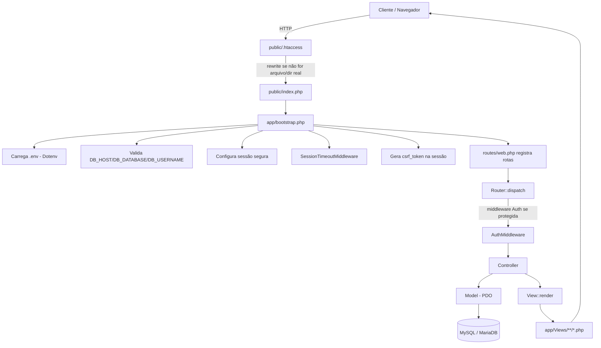
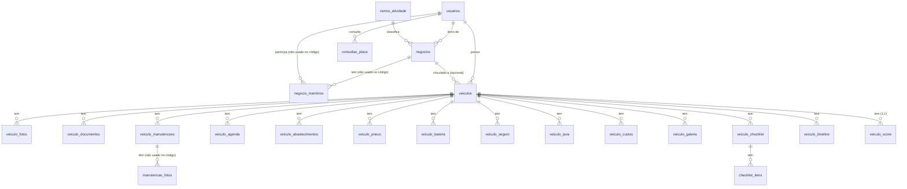
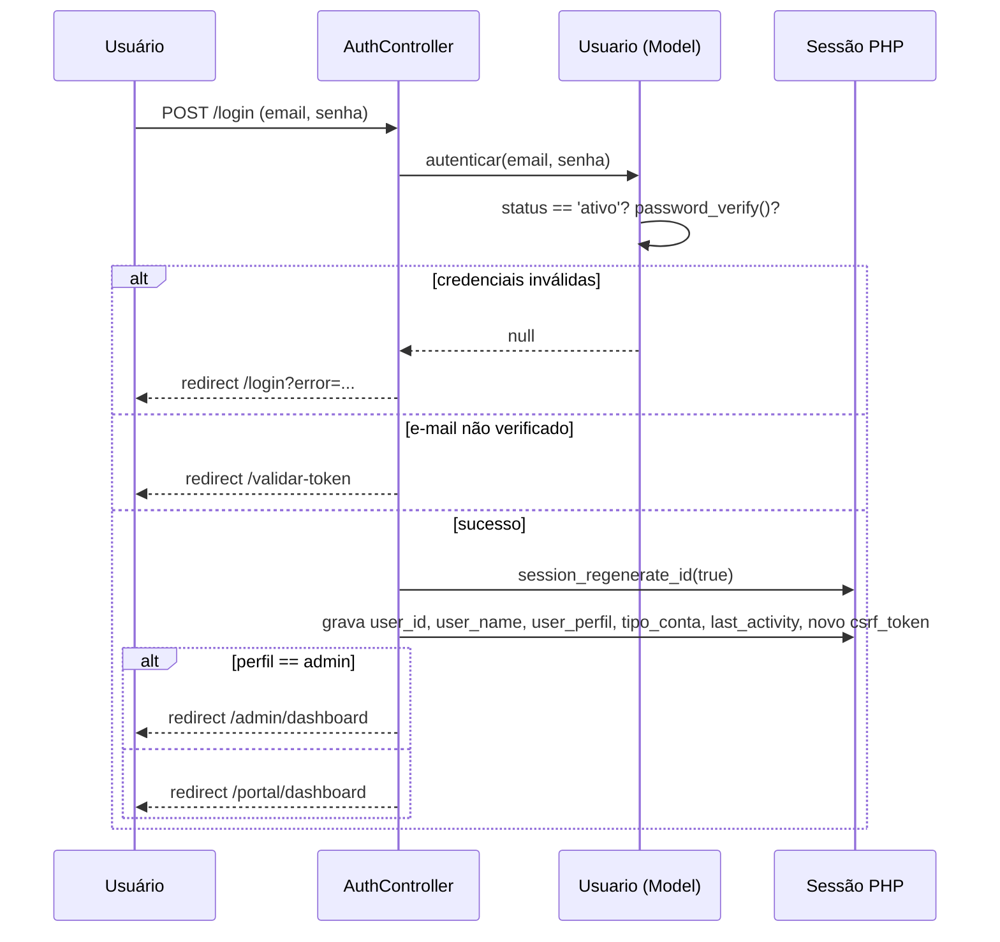
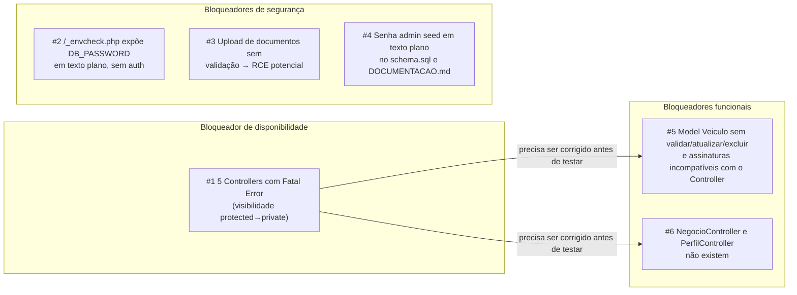
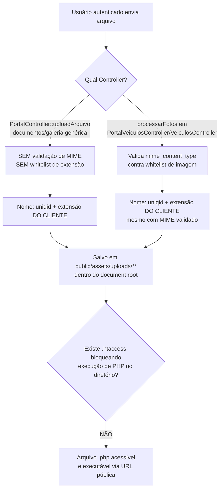

# AppAuto — Mapa Técnico do Sistema

> Documento de apoio à `.claude/skills/appauto/SKILL.md`. Enquanto a Skill é a referência
> condensada para trabalho diário, este documento traz o mapa completo com diagramas,
> pensado para que um desenvolvedor (humano ou IA) novo no projeto entenda o AppAuto sem
> precisar redescobrir tudo. Gerado por engenharia reversa do commit `77bbe18` (branch
> `main`, único branch existente, 14 commits, working tree limpo).

## 1. Arquitetura Geral



**Observação importante:** este diagrama descreve o fluxo *pretendido* pelo código. Na
prática, 5 dos 10 controllers autenticados (Auth, Admin, Portal, PortalVeiculos, Veiculos)
falham no passo "Controller" com um **fatal error de PHP antes mesmo de instanciar** — ver
seção 7 e a Skill, seção 24, problema #1.

## 2. Estrutura de Diretórios

```
appautodesktop/
├── app/
│   ├── bootstrap.php          Ponto de entrada da aplicação (chamado por public/index.php)
│   ├── Controllers/           16 controllers (ver seção 5)
│   ├── Core/                  Router, Controller (base), Database (PDO singleton),
│   │                          Auth (hash/verify de senha), Logger, View, Model (base), Middleware (base)
│   ├── Middlewares/           AuthMiddleware (única registrada no Router),
│   │                          CsrfMiddleware (implementada mas NUNCA associada a rota),
│   │                          SessionTimeoutMiddleware (chamada direto no bootstrap)
│   ├── Models/                Usuario, Negocio, Veiculo, User (órfão/legado)
│   └── Views/                 45 arquivos .php — ver seção 6
├── config/
│   └── database.php           Credenciais lidas de $_ENV com fallback vazio
├── database/
│   ├── schema.sql              Schema base (10 tabelas + seeds de ramos e admin)
│   ├── migrations/
│   │   └── 002_portal_veiculos.sql   14 tabelas do Portal de Veículos
│   └── seeders/AdminUserSeeder.sql
├── md/                         Documentação histórica — maioria do ERP INLAUDO (ver seção 9)
├── public/                     Document root real do servidor web
│   ├── index.php                Único ponto de entrada roteado
│   ├── .htaccess                Rewrite para index.php + Options -Indexes
│   ├── assets/uploads/          Uploads de usuário (fotos, documentos) — ver riscos seção 8
│   └── DEBUG_*.php, diagnostico.php, test_env.php, _envcheck.php
│                                 Scripts de debug expostos publicamente — ver seção 8
├── routes/web.php              Única fonte de rotas (~70 rotas)
├── storage/logs/               Logs em texto plano (bootstrap, router, view, auth, error...)
├── vendor/                     Versionado propositalmente (deploy sem SSH/Composer no Hostgator)
├── composer.json / composer.lock
├── .env.example                 Nomes de variáveis, sem valores reais
├── .gitignore
├── check_env.php               Script de diagnóstico na raiz (fora do document root — menos exposto)
├── DEPLOY.md, DOCUMENTACAO.md, README_PATCH.md   Documentação na raiz (ver seção 9)
└── .claude/skills/appauto/SKILL.md   Skill oficial (este mapeamento)
```

## 3. Diagrama Entidade-Relacionamento



Tabelas existentes no schema mas **sem nenhum código que as leia/grave** (achado do
mapeamento, não conjectura): `negocio_membros`, `audit_logs`, `email_tokens`,
`admin_sessoes`, `manutencao_fotos`.

## 4. Fluxo de Autenticação



**Nó crítico:** `AuthController` está entre os 5 controllers com fatal error de
carregamento (Skill, seção 24, #1) — este fluxo está descrito conforme o código-fonte, mas
**não executa** no estado atual do commit `77bbe18` até a correção de visibilidade ser aplicada.

## 5. Matriz de Rotas → Controller → Model → Banco

| Rota | Método | Controller@Action | Model(s) | Tabelas | View | Status real |
|---|---|---|---|---|---|---|
| /login | GET/POST | AuthController@showLoginForm/@login | Usuario | usuarios | auth/login | **Fatal error (classe não carrega)** |
| /cadastro | GET/POST | AuthController@showCadastroForm/@cadastrar | Usuario, Negocio | usuarios, negocios, ramos_atividade | auth/cadastro | **Fatal error** |
| /validar-token | GET/POST | AuthController@... | Usuario | usuarios | auth/validar_token | **Fatal error** |
| /recuperar-senha | GET/POST | AuthController@showRecuperarSenha/@recuperarSenha | — | — | — | **Método inexistente (além do fatal error)** |
| / , /dashboard | GET | HomeController / DashboardController | — | — | — (só redirect) | OK |
| /logout | GET/POST | AuthController@logout | — | — | — | **Fatal error** |
| /portal/dashboard | GET | PortalController@dashboard | — (SQL direto) | veiculos, veiculo_* | portal/dashboard | **Fatal error** |
| /portal/veiculos* | GET/POST | PortalVeiculosController | Veiculo | veiculos, veiculo_fotos | portal/veiculos/* | **Fatal error + métodos de Model ausentes** |
| /veiculos* | GET/POST | VeiculosController | Veiculo | veiculos, veiculo_fotos, consultas_placa | veiculos/* | **Fatal error** |
| /portal/manutencoes* ... /portal/marketplace | GET/POST | PortalController | — (SQL direto) | veiculo_* (ver Skill seção 6) | portal/* | **Fatal error** |
| /negocio/dashboard, /negocio/clientes, /negocio/servicos | GET | NegocioController | — | — | — | **Controller inexistente** |
| /perfil | GET/POST | PerfilController | — | — | — | **Controller inexistente** |
| /configuracoes | GET | ConfiguracoesController | — | — | placeholder/index | OK (placeholder) |
| /admin/dashboard, /admin/clientes/* , /admin/acessar-*, /admin/sair-impersonacao | GET | AdminController | Usuario, Negocio | usuarios, negocios, ramos_atividade | admin/* | **Fatal error** |
| /admin/logs, /admin/configuracoes, /admin/usuario/{id}, /admin/negocio/{id} | GET | AdminController | — | — | — | **Método inexistente (além do fatal error)** |
| /clientes, /financeiro/*, /faturamento, /integracao | GET | stubs (Clientes/Financeiro/Faturamento/Integracao*) | — | — | placeholder/index | OK (placeholder) |

## 6. Frontend — Views

Sem framework JS, sem bundler. Cada módulo do Portal segue o padrão
`app/Views/portal/{modulo}/index.php` (+ `adicionar.php` quando há formulário de criação
separado). `View::render()` decide o layout por prefixo do nome da view:

- `auth/`, `admin/`, `veiculos/`, `negocio/`, `perfil/`, `portal/` → view "self-contained"
  (inclui seu próprio header/footer via `require`).
- Qualquer outra (`dashboard/`, `home/`) → layout legado (`erp_header/footer.php`,
  branding INLAUDO, ou fallback genérico `header/footer.php`).

Views referenciadas por Controller mas ausentes em disco: `portal/ipva/index.php`,
`veiculos/show.php` (ambas resultam em erro 500 tratado, não fatal, quando acessadas).

## 7. Achados Críticos (resumo executivo — detalhes na Skill, seção 24)



Todos os 6 itens acima foram **confirmados por execução isolada de código nesta sessão**
(não são suposições de leitura) — ver comandos reproduzíveis na Skill, seção 24 e 32.

## 8. Uploads — Fluxo e Riscos



## 9. Documentação — Confiável vs. Histórica/Inconsistente

### Confiável para o AppAuto (validar sempre contra o código antes de usar)

- `md/README.md`'s título é enganoso ("ERP INLAUDO..."), mas o restante do arquivo é
  específico do fluxo de login do AppAuto — **tratar com cautela, não como fonte primária**.
- `DOCUMENTACAO.md` (raiz) — visão geral genuinamente sobre o AppAuto, tecnicamente
  alinhada ao código, **porém expõe a senha do admin seed em texto plano** (não reproduzir;
  tratar como vazamento, não como informação a ser repassada).
- `.env.example` — nomes de variáveis corretos e atuais.
- `database/schema.sql` e `database/migrations/002_portal_veiculos.sql` — fonte de verdade
  do banco (mas contém a senha do seed em comentário — mesmo problema acima).

### Histórica / Inconsistente — não usar como referência de arquitetura atual

- `DEPLOY.md` — título literal "Guia de Deploy - INLAUDO ERP v1.1". Descreve correções de
  uma versão anterior do sistema sob outro nome. Útil só como contexto histórico de
  infraestrutura (Hostgator, requisitos de PHP/MySQL), não como procedimento vigente.
- `README_PATCH.md` — mesmo padrão, pacote de correção do "ERP INLAUDO".
- `md/CODIGO_CORRIGIDO_LOGIN.md`, `md/DIAGNOSTICO_ENV.md`,
  `md/GUIA_IMPLEMENTACAO_AUTENTICACAO.md`, `md/ANALISE_ROUTER_BOOTSTRAP.md`,
  `md/AUDITORIA_API_AUTENTICACAO.md` — documentam a mesma saga de depuração do erro 500 de
  login que resultou nos scripts de debug hoje expostos em `public/`. Contexto histórico
  útil para entender *por que* esses scripts existem, mas não descrevem o estado atual do
  código (o próprio problema #1 desta sessão mostra que o login segue quebrado por um
  motivo diferente do que essas notas resolveram).
- `app/Views/layout/erp_header.php` / `erp_footer.php` — HTML com título "INLAUDO ERP -
  Dashboard" e link para `inlaudo.com.br`. Usado como fallback de layout para views fora do
  padrão self-contained. Deve ser substituído por um layout com identidade AppAuto assim
  que as views legadas (`dashboard/`, `home/`) forem revisadas.
- `public/assets/logo-inlaudo.png` — arquivo de logo do produto anterior, ainda no repositório.

## 10. Como Este Mapa Foi Produzido

Clone read-only do repositório oficial (`https://github.com/choppon24h-png/appautodesktop`,
branch `main`, commit `77bbe18`) + leitura de 100% dos arquivos `.php`/`.sql` em
`app/`, `config/`, `database/`, `public/`, `routes/`; execução isolada via `php -r` para
confirmar fatais de classe; `grep`/busca cruzada entre `View::render()` e arquivos de view
em disco para achar views ausentes; busca cruzada entre chamadas de método em Controllers e
assinaturas reais em Models. Nenhum arquivo de produção foi alterado — esta é uma missão de
mapeamento e documentação apenas (ver instruções mestras do projeto, seção 22).
